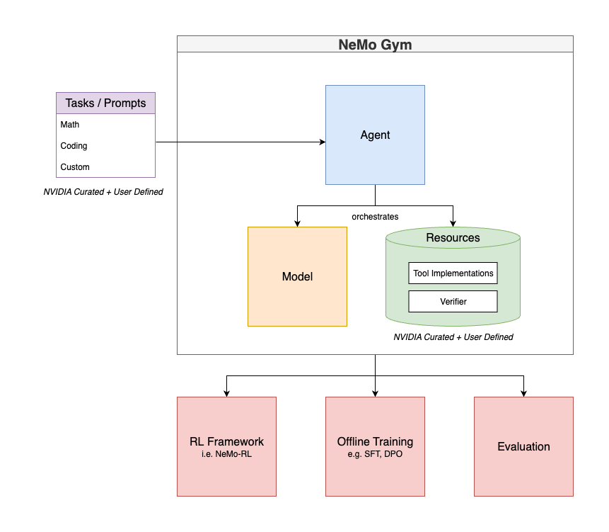

(core-abstractions)=

# Core Abstractions

Before diving into code, let's understand the three core abstractions in NeMo Gym.

> If you are new to reinforcement learning for LLMs, we recommend you review **[Key Terminology](./key-terminology)** first.

::::{tab-set}

:::{tab-item} Model

Responses API Model servers are model endpoints that performs text inference - stateless, single-call text generation without conversation memory or orchestration. You will always have at least one Response API Model server active during training, typically known as the "policy" model.

**Available Implementations:**
- `openai_model`: Direct integration with OpenAI's Responses API  
- `vllm_model`: Middleware converting local models (via vLLM) to Responses API format

**Configuration:** Models are configured with API endpoints and credentials via YAML files in `responses_api_models/*/configs/`

:::

:::{tab-item} Resources

Resources servers provide tools implementations that can be invoked via tool calling and verification logic that measure task performance. NeMo Gym contains a variety of NVIDIA and community contributed resources servers that you may wish to utilize during training. We also have tutorials on how to add your own Resource server.

**What Resources Provide**

Each resource server combines both tools and verifiers:
- **Tools**: Functions agents can call during task execution
- **Verifiers**: Scoring logic that evaluates performance (returns reward signals for training)

**Example Resource Servers**

Each example shows what **tools** the agent can use and what **verifier** logic measures success:

- **`google_search`**: Web search with verification
  - **Tools**: `search()` queries Google API; `browse()` extracts webpage content
  - **Verifier**: Checks if final answer matches expected result for MCQA questions

- **`math_with_code`**: Mathematical reasoning with code execution
  - **Tool**: `execute_python()` runs Python code with numpy, scipy, pandas
  - **Verifier**: Extracts boxed answer and checks mathematical correctness

- **`code_gen`**: Competitive programming problems
  - **Tools**: None (agent generates code directly)
  - **Verifier**: Executes generated code against unit test inputs/outputs

- **`math_with_judge`**: Mathematical problem solving
  - **Tools**: None (or can be combined with `math_with_code`)
  - **Verifier**: Uses math library + LLM judge to verify answer equivalence

- **`mcqa`**: Multiple choice question answering
  - **Tools**: None (knowledge-based reasoning)
  - **Verifier**: Checks if selected option matches ground truth

- **`instruction_following`**: Instruction compliance evaluation
  - **Tools**: None (evaluates response format/content)
  - **Verifier**: Checks if response follows all specified instructions

- **`simple_weather`**: Mock weather API
  - **Tool**: `get_weather()` returns mock weather data
  - **Verifier**: Checks if weather tool was called correctly

**Configuration**: See resource-specific config files in `resources_servers/*/configs/`

:::

:::{tab-item} Agents

Responses API Agent servers orchestrate the interaction between models and resources.

- Route requests to the right model
- Provide tools to the model
- Handle multi-turn conversations
- Format responses consistently

An agent can also be referred to as a "training environment." NeMo Gym contains several training environment patterns that cover a variety of scenarios including multi-step, multi-turn, or user modeling scenarios.

**Examples:**
- `simple_agent`: Basic agent that coordinates model calls with resource tools

**Configuration Pattern**:
```yaml
your_agent_name:                     # server ID
  responses_api_agents:              # server type. corresponds to the folder name in the project root
    your_agent_name:                 # agent type. name of the folder inside the server type folder 
      entrypoint: app.py             # server entrypoint path, relative to the agent type folder 
      resources_server:              # which resource server to use
        name: simple_weather         
      model_server:                  # which model server to use
        name: policy_model           
```

:::
::::


<div align="center">
  
</div>
